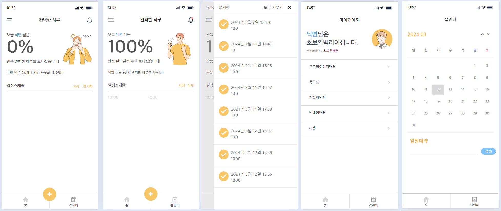

# 완벽한 그날 프로젝트

## ✏️ working category

개인 사이드 프로젝트
 
 
🖥️ using project : https://perfect-day.netlify.app
 

## 📃 using lang

TypeScript,React,React-Router-dom,ContextAPI,SCSS
 
 

## 프로젝트 아이디어

오늘 하루 일과를 기입하는 todoList 앱을 사용 중 나도 한번 만들어 볼까 하는 생각으로 시작
 
 

## Preview

  

### 📌 주요기능

- 하루 총 일과 / 완료된 일과를 퍼센트로 계산해서 50% / 75% / 100% 구간마다 이미지를 다르게 노출시켜 일과 완료 단계를 나눔
- 인터넷이 끊켜도 데이터를 저장할 수 있게 localstorage를 사용 (완벽한 하루 이기 때문에 하루 지나면 데이터는 사라짐)
- 생성일로부터 현재일까지 시간을 계산하여 몇일째 사용중인지 노출
- 이전에 완료한 일정을 확인 할 수 있는 알림함 추가
- 나만의 프로필을 설정 할 수 있는 마이 페이지를 추가
- 하루동안 일과 100프로를 채울 때 마다 점수 1점을 획득하여 특정 점수를 만족하게 되면 등급이 올라가는 랭킹 시스템 추가
- 캘린더를 추가하여 일정예약 시스템 추가

### ✔ 체크해야 할 사항

- [x] 일과 리스트를 추가 할 때 마다 계속 퍼센트가 바뀌어야 함
- [x] 일과 데이터는 하루 지나면 삭제 되어야함
- [x] 라이브러리를 쓰지 않고 캘린더 구현

### 🚀 기능 구현

- 체크사항 기능 구현 1 : 일과 완료된 갯수 / 총 할일의 배열길이 \* 100
- 체크사항 기능 구현 2 : 쿠키를 사용하여 오늘 자정이 되면 localstorage를 지우게 함
- 체크사항 기능 구현 3 : calendar.tsx 주석 참조

### 🧑🏻‍💻 트러블 슈팅

#### 트러블 슈팅에 사용 되는 변수들

creationDay : 생성일자 
CurrentUser : 유저 닉네임 
LoadData : 완료된 일정이나 캘린더에 작성된 일정을 불러와서 연결 시켜줌 
dayMemo : 생성일자를 localstorage로 불러와서 현재일로 부터 몇일이 지났는지 계산해줌 

#### 트러블 슈팅 1

문제발견 : 앱 이용 중 사용기록 삭제나 로컬 스토리지를 조작 했을 때 해당 변수의 데이터가 없는데도 작동을 하게 됨.  
문제인식 : 정해진 시간마다 계속 데이터를 체크해주고 데이터가 없으면 login 페이지로 redirect 시켜주려고 함  
문제판단 : 사실 localstorage가 아니라 백엔드에서 api를 가져오는 거라면 react-query를 사용 해도 되겠지만 localStorage는 다른 개념이기 때문에
setInterval를 사용 하기로 판단  
해결법 : 5초마다 setInterval을 사용해서 localstorage를 불러온 다음에 둘중 하나라도 null이 있으면 해당 로컬스토리를 지우고 useNavigate를 사용하여
login페이지로 이동 

#### 트러블 슈팅 2

 

컴포넌트가 재 랜더링 될 때 변수나 리턴이 있는 모든 함수가 재 실행 되는데 이때 바뀌지 않는 값을 메모 처리 하는 것을 말함

#### 1번째 사례

dayMemo : 현재 일에서 생성일자를 빼서 흐른 일수를 출력하는 함수

문제 : return이 있는 함수라서 재 랜더링 될때마다 함수를 호출함 

해결법 : const memorizeDay = useMemo(()=>{
return dayMemo(creation)
})
 
memorizeDay 변수에 useMemo를 연결해서 useMemo의 콜백 함수로 dayMemo를 실행하면 결론적으로 return number이 출력된다.

#### 2번째 사례

캘린더에 쓰이는 함수들 메모처리  
prevMonth/nextMonth/createDate/returnDay/todayCheck 
useCallback을 사용하여 selectMonth/selectedYear에 의존성을 걸어 년도나 달이 바뀔때만 실행되게 작성

prevMonth/nextMonth 
calendar.tsx 35번째줄에서 54번째 줄 참조

createDate/returnDay/todayCheck 
calendar.tsx 60번째 줄에서 165번째 줄 참고
